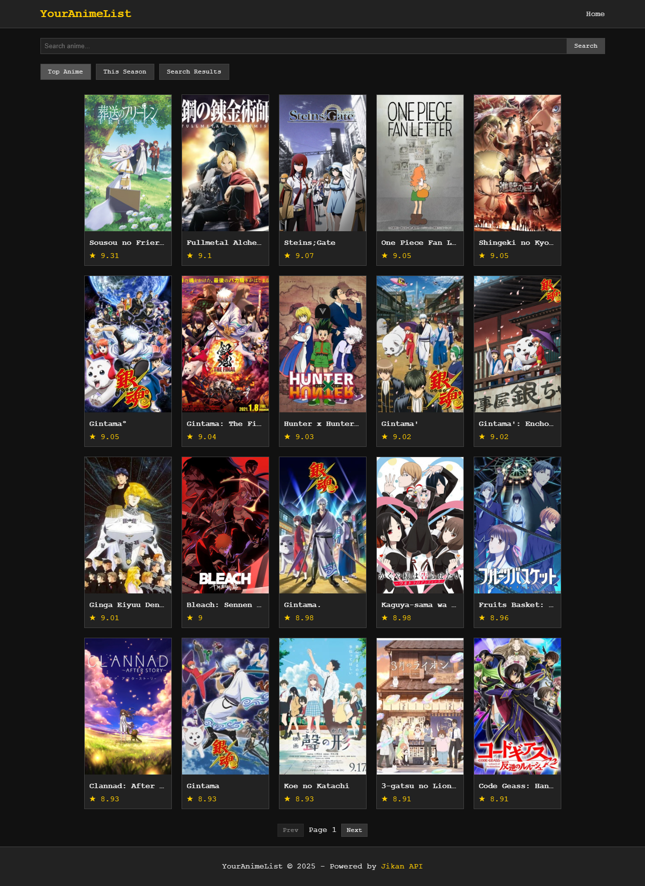
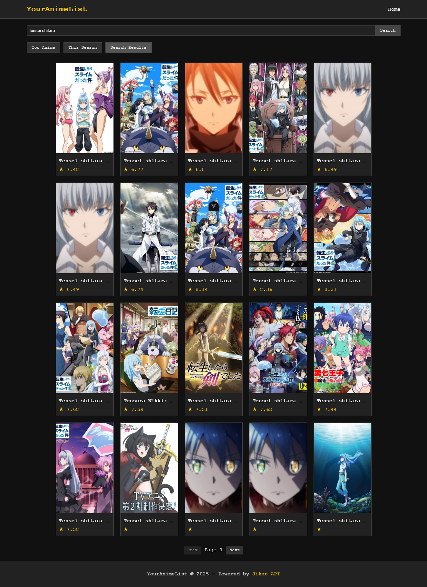

# 🌟 YourAnimeList 🌟


## 👾 Selamat Datang di YourAnimeList! 👾

*"Petualanganmu mencari anime favorit dimulai di sini!"*

YourAnimeList adalah website database anime bergaya retro yang dibangun dengan Vue.js dan TypeScript, didukung oleh API Jikan.moe. Website ini menawarkan pengalaman sederhana namun kuat untuk para pecinta anime yang ingin menjelajahi, mencari, dan mendiskusikan anime favorit mereka.

## ✨ Fitur Utama

🔍 **Pencarian Anime** - Temukan anime favoritmu dengan mudah  
🏆 **Top Anime** - Lihat anime dengan rating terbaik  
🌸 **Anime Musiman** - Jelajahi anime terbaru setiap musim  
📽️ **Trailer Embed** - Tonton trailer langsung dari halaman detail  
💬 **Komentar Disqus** - Diskusikan anime dengan komunitas  
📱 **Responsive Design** - Tampilan optimal di semua perangkat  

## 📚 Tech Stack

- Vue.js 3 + Vite
- TypeScript
- Jikan API (https://jikan.moe)
- Disqus Comment System
- CSS murni tanpa framework

## 🚀 Cara Memulai

### Prerequisites

- Node.js (versi 14+)
- NPM atau Yarn

### Instalasi

```bash
# Clone repository
git clone https://github.com/rakarmp/retro-anime.git

# Pindah ke direktori project
cd retro-anime

# Install dependencies
npm install
# atau
yarn install

# Jalankan server development
npm run serve
# atau
yarn serve
```

Buka [localhost:5173](localhost:5173) di browser untuk melihat aplikasi.

### Konfigurasi Disqus

Untuk mengaktifkan sistem komentar, ubah nilai `disqusShortname` di file `src/views/AnimeDetailPage.vue`:

```javascript
const disqusShortname = 'YOUR_DISQUS_SHORTNAME'; // Ganti dengan shortname Disqus Anda
```

## 📱 Responsivitas

YourAnimeList didesain untuk berfungsi sempurna di berbagai ukuran layar:

- 📱 **Mobile**: 320px ke atas
- 📱 **Tablet**: 768px ke atas
- 💻 **Desktop**: 1024px ke atas

## 📸 Screenshots

### 🏠 Halaman Utama


### 🔍 Hasil Pencarian


### 📃 Halaman Detail Anime


## 🎮 Contoh Penggunaan API

```typescript
// Mengambil data Top Anime
const topAnimes = await AnimeService.getTopAnimes(page);

// Mencari anime berdasarkan judul
const searchResults = await AnimeService.searchAnimes(query);

// Mendapatkan detail anime berdasarkan ID
const animeDetails = await AnimeService.getAnimeById(id);
```

## 🌐 API References

YourAnimeList menggunakan [Jikan API](https://jikan.moe), API tidak resmi untuk MyAnimeList.

Endpoint utama yang digunakan:
- `/top/anime` - Untuk daftar Top Anime
- `/anime?q=` - Untuk pencarian
- `/anime/{id}/full` - Untuk detail anime
- `/seasons/{year}/{season}` - Untuk anime musiman

## 💖 Credits

- Jikan API (https://jikan.moe)
- Vue.js Team
- Semua kontributor open source yang membuat proyek ini mungkin
- Semua studio anime dan kreator yang telah memberikan karya luar biasa

---

<div align="center">
  
  <p><i>"Semua anime yang kamu cintai, dalam satu tempat."</i></p>
</div>